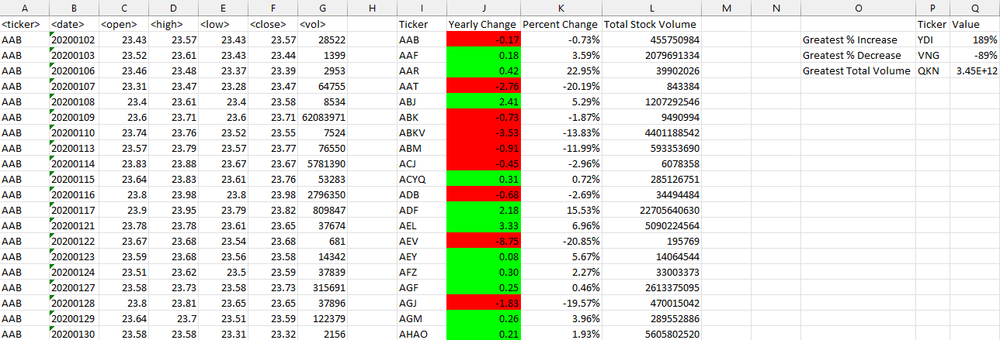

# Module2VBAchallenge

This VBA script analyzes an Excel workbook of generated stock market data from 2018 to 2020.The script loops through multiple Excel worksheets to output the ticker symbol for each stock and run calculations for the yearly changes based on the opening and closing prices, the yearly percent changes, and the stocks’ total volume. Conditional formatting highlights the positive changes in green and negative changes in red to simplify the visual analysis. Additionally, the script also identifies stocks with the greatest percent increase, decrease, and the greatest total volume. 

